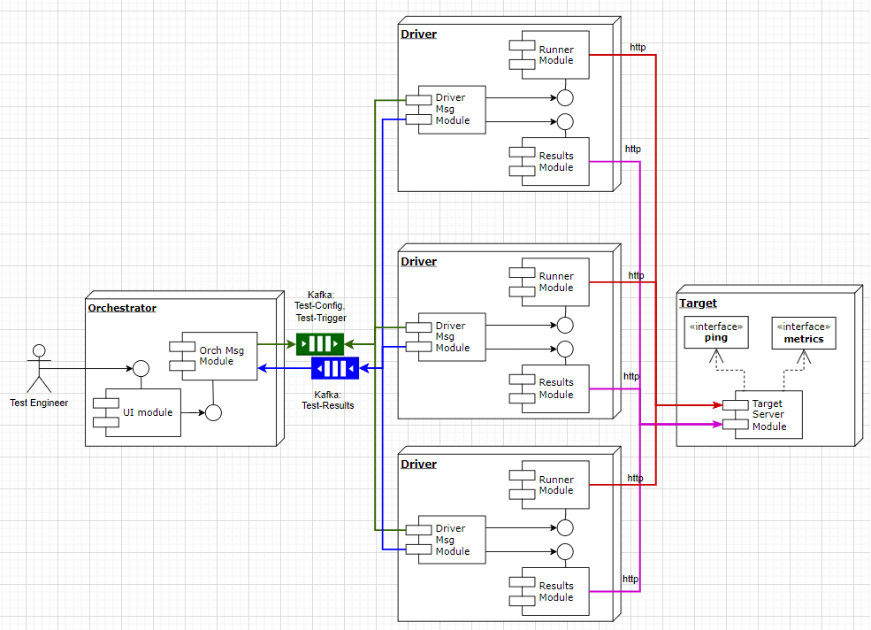

# Distributed Load Testing

**Deployment diagram**

## Usage

A distributed load test is a type of performance testing that involves simulating the behavior of multiple users or components in a distributed computing environment. The goal is to assess the performance, scalability, and reliability of a system under various conditions. In the context of your provided information, a distributed load test involves the following components:

## Orchestrator Node:

        Manages and coordinates the load testing process.
        Exposes a REST API to view and control different tests.
        Can trigger a load test by sending configuration messages to driver nodes.
        Reports statistics for the current load test, including information about the requests sent by each driver node.
        Implements a runtime controller that handles heartbeats from driver nodes, coordinates between driver nodes to trigger load tests, and receives metrics from driver nodes.

## Driver Node:

        Sends requests to a target web server as indicated by the Orchestrator node.
        Records statistics for response time metrics such as mean, median, min, and max.
        Sends the collected results back to the Orchestrator node.
        Implements a communication layer that talks to the central Kafka instance, facilitating communication with the Orchestrator node.

## Target HTTP Server:

        Represents the system or service being tested.
        Provides an endpoint (/ping) for testing purposes.
        Includes a metrics endpoint (/metrics) to see the number of requests sent and responses received.

## Kafka:

        Serves as a central communication hub for the distributed load testing system.
        Nodes register themselves through the register topic.
        Orchestrator node publishes test configuration messages to the test_config topic to send out test parameters to all driver nodes.
        Orchestrator node triggers load tests by publishing messages to the trigger topic.
        Driver nodes publish their aggregate metrics to the metrics topic at regular intervals during the load test.
        Driver nodes publish heartbeats to the heartbeat topic at regular intervals during the load test.

## Load Testing Types:

        Tsunami Testing: Allows the user to set a delay interval between each request, and the system maintains this gap between each request on each node.
        Avalanche Testing: All requests are sent as soon as they are ready in first-come first-serve order. Users can provide a target throughput per driver node, and the system respects it.

## Installation

 pip install concurrently
 
 pip install Flask

 pip install requests
 
 pip install flask-cors

## How to run

open 1 terminal in d ( cd src/d )

open 1 terminal in o (cd src/o)

open 1 terminal in t (cd src/t)

start the target server

python3 target_server.py   (in the terminal src/t)

start the orchestrator

python3 o3.py (in the terminal src/o)

start the driver (say one for now)

python3 d1.py one (in the terminal src/d, "one" is node_id).

Run all the Flask applications

## How to end

We need to stop the Orchestrator

We run python3 end.py end

## Contribution 

Sathvik Nag - Orchestrator

Vaibhav Isloor - Orchestrator

Melvin Gomez - Driver

Ananya Bhatia - Driver